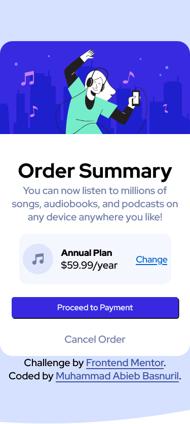

# Frontend Mentor - Order summary card solution

This is a solution to the [Order summary card challenge on Frontend Mentor](https://www.frontendmentor.io/challenges/order-summary-component-QlPmajDUj). Frontend Mentor challenges help you improve your coding skills by building realistic projects. 

## Table of contents

- [Overview](#overview)
  - [The challenge](#the-challenge)
  - [Screenshot](#screenshot)
  - [Links](#links)
- [My process](#my-process)
  - [Built with](#built-with)
  - [What I learned](#what-i-learned)
  - [Continued development](#continued-development)
  - [Useful resources](#useful-resources)
- [Author](#author)

## Overview

### The challenge

Users should be able to:

- Using flexbox on this project

### Screenshot

### Links

- Solution URL: [Add solution URL here](https://your-solution-url.com)
- Live Site URL: [Add live site URL here](https://your-live-site-url.com)

## My process

### Built with

- Semantic HTML5 markup
- CSS custom properties
- Flexbox

### What I learned

Have deeper understanding of flexbox and HTML 5 elements

To see how you can add code snippets, see below:

### Continued development

With deeper understanding of CSS and HTML5, i want to learn something new such as javascript

### Useful resources

- [ resource 1](https://www.w3schools.com/html/default.asp) 
- [ resource 2](https://www.w3schools.com/css/default.asp) 

## Author

- Frontend Mentor - [AbibGuardian50](https://www.frontendmentor.io/profile/AbibGuardian50)
